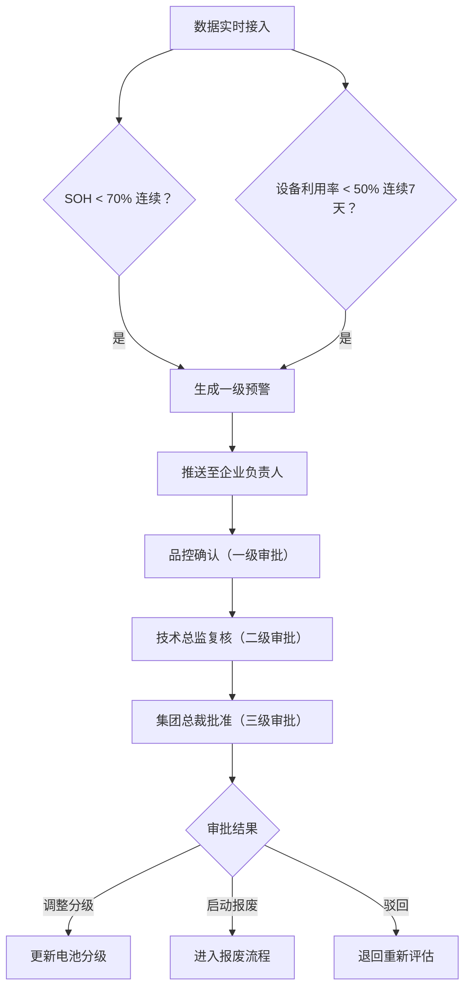
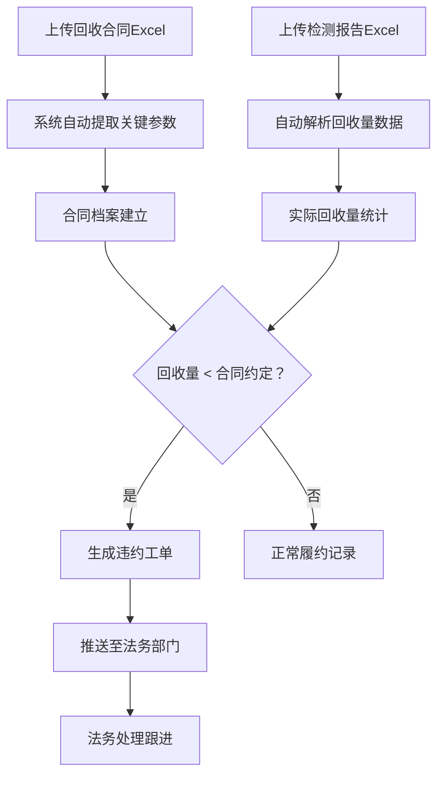
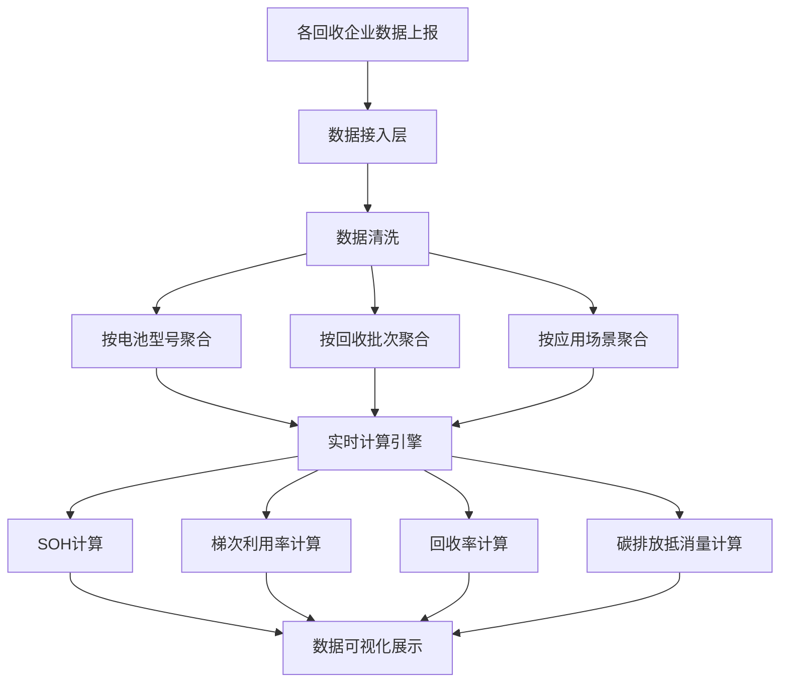

# 动力电池回收与梯次利用智能监测分析平台 PRD

## 1. 产品概述

全国性新能源汽车动力电池回收与梯次利用智能监测分析平台，实时接入回收企业的全链路数据，提供电池健康度评估、梯次利用监测、预警审批、合同管理及碳减排核算等核心能力。

- 解决动力电池回收行业数据分散、健康评估滞后、梯次利用效率低、监管困难等痛点
- 面向集团管理层、区域负责人、工厂运维人员及法务/品控部门，提供分级数据视图与决策支持

## 2. 核心功能

### 2.1 用户角色

| 角色 | 注册方式 | 核心权限 |
|------|----------|----------|
| 集团管理员 | 系统分配 | 全国数据总览、审批最终决策、全功能权限 |
| 区域负责人 | 系统分配 | 所辖区域数据查看、区域内审批复核 |
| 工厂管理员 | 系统分配 | 本厂数据查看、预警处理、数据上报 |
| 品控人员 | 系统分配 | 预警一级审批、检测报告审核 |
| 技术总监 | 系统分配 | 预警二级审批、技术方案调整 |
| 法务人员 | 系统分配 | 合同管理、违约工单处理 |

### 2.2 功能模块

1. **核心看板**：全国回收热力图、梯次利用率排名、核心指标卡片、省份切换下钻
2. **预警中心**：一级预警列表、三级审批流程、预警历史追溯
3. **电池档案**：电池型号管理、批次追踪、SOH 趋势分析、电芯等级分布
4. **梯次利用**：应用场景监测、设备利用率、梯次组装数据
5. **合同管理**：合同上传与解析、检测报告管理、违约工单
6. **健康诊断**：周报自动生成、同比环比分析、优化建议
7. **系统管理**：用户权限、组织架构、数据接入配置

### 2.3 页面详情

| 页面名称 | 模块名称 | 功能描述 |
|----------|----------|----------|
| 核心看板 | 统计指标卡片 | 实时显示总回收量、SOH均值、梯次利用率、回收率、碳减排量 |
| 核心看板 | 全国热力图 | 按省份展示回收量热力分布，支持点击下钻 |
| 核心看板 | 梯次利用率排名 | 各省/各工厂梯次利用率排名列表 |
| 核心看板 | 省份切换器 | 顶部省份下拉，切换数据视图范围 |
| 省份详情 | SOH 趋势曲线 | 近30天电池健康度变化趋势图 |
| 省份详情 | 电芯等级分布 | 各等级电芯数量占比饼图/柱状图 |
| 省份详情 | 工厂列表 | 该省所有回收工厂数据概览 |
| 预警中心 | 预警列表 | 展示所有预警，按等级、状态筛选 |
| 预警中心 | 审批流程 | 三级审批操作界面，显示当前审批节点 |
| 预警中心 | 预警详情 | 预警原因、历史数据、处理记录 |
| 合同管理 | 合同列表 | 所有回收合同概览，支持搜索筛选 |
| 合同管理 | Excel 上传 | 上传回收合同及检测报告，自动提取参数 |
| 合同管理 | 违约工单 | 回收量低于合同约定自动生成的工单列表 |
| 健康诊断 | 周报列表 | 历史诊断报告列表 |
| 健康诊断 | 报告详情 | 回收量同比环比、梯次合格率、碳减排对比、优化建议 |
| 系统管理 | 用户权限 | 三级权限用户管理 |
| 系统管理 | 组织架构 | 集团-区域-工厂层级管理 |

## 3. 核心流程

### 3.1 预警与审批流程

电池批次SOH连续低于70%或设备利用率连续7天低于50%时，系统自动生成一级预警，推送至企业负责人。预警处理需经过三级审批：品控确认 → 技术总监复核 → 集团总裁批准，最终决定调整分级或启动报废。

### 3.2 合同与违约处理流程

### 3.3 数据接入与计算流程

## 4. 用户界面设计

### 4.1 设计风格

- **主色调**：深科技蓝 (#0A2463) 搭配活力绿 (#3E885B)，体现新能源与环保主题
- **辅助色**：警示橙 (#F45D01)、危险红 (#D62828)、信息青 (#00B4D8)
- **背景**：深色主题为主 (#0B1120)，搭配渐变与微弱发光效果
- **字体**：标题使用 Montserrat 加粗，正文使用 Inter，数字使用 JetBrains Mono 等宽字体
- **按钮风格**：圆角中等 (8px)，悬浮时有微光效果
- **布局风格**：卡片式布局，带有玻璃拟态 (Glassmorphism) 效果
- **图标风格**：线性图标，统一 2px 描边

### 4.2 页面设计概览

| 页面名称 | 模块名称 | UI 元素 |
|----------|----------|---------|
| 核心看板 | 统计指标卡片 | 玻璃拟态卡片、渐变数字、趋势箭头、微动效 |
| 核心看板 | 全国热力图 | SVG 中国地图、省份渐变色、悬浮tooltip、点击下钻动画 |
| 核心看板 | 排名列表 | 金银铜奖牌样式、进度条、省份标签 |
| 核心看板 | 趋势小图 | 迷你面积图、渐变填充 |
| 省份详情 | SOH 趋势曲线 | 多色折线图、渐变区域、时间轴缩放 |
| 省份详情 | 电芯分布 | 环形图 + 详细数据表格 |
| 预警中心 | 预警卡片 | 状态标签、严重程度色条、倒计时显示 |
| 预警中心 | 审批流程 | 步骤条、当前节点高亮、审批意见输入框 |
| 合同管理 | 上传区域 | 拖拽上传、文件预览、解析进度条 |
| 健康诊断 | 报告页 | 杂志式排版、数据可视化、重点高亮 |

### 4.3 响应式

- 桌面端优先设计（1440px 基准）
- 适配 1280px、1024px 平板尺寸
- 热力图在小屏幕下切换为列表视图
- 侧边栏在移动端收起为汉堡菜单

### 4.4 动效设计

- 页面加载：卡片渐入 + 错位动画 (staggered reveal)
- 数据更新：数字滚动动画、指标卡片呼吸光效
- 地图交互：省份悬浮放大、点击涟漪效果
- 审批流转：节点连线生长动画
- 预警出现：轻微震动 + 红色脉冲效果
