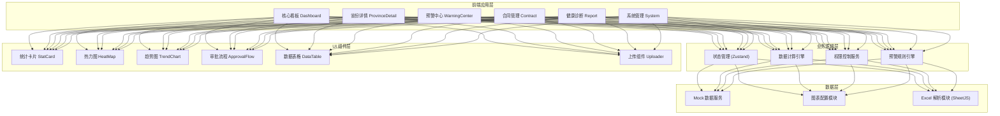
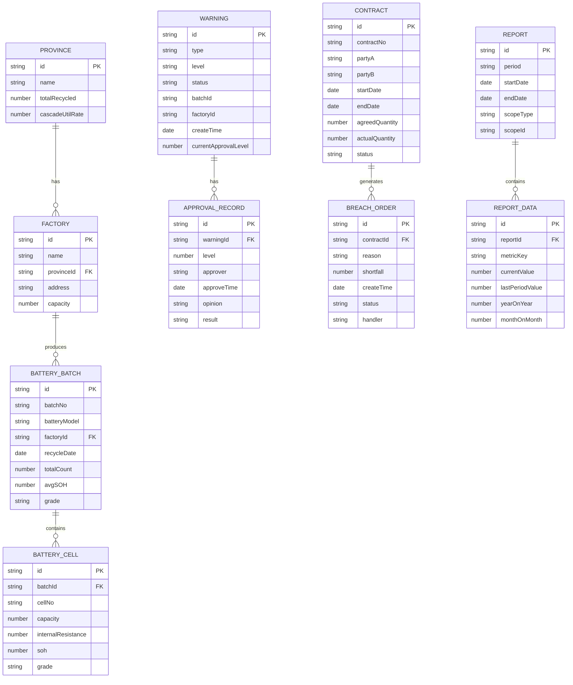

# 动力电池回收与梯次利用智能监测分析平台 技术架构文档

## 1. 架构设计



## 2. 技术描述

- **前端框架**：React@18 + TypeScript
- **构建工具**：Vite@5
- **样式方案**：TailwindCSS@3 + CSS Variables
- **状态管理**：Zustand (轻量级状态管理)
- **路由管理**：React Router v6
- **图表库**：ECharts@5 (支持热力图、折线图、饼图等丰富图表)
- **UI 组件**：Radix UI (无样式组件库，高度可定制)
- **图标库**：Lucide React
- **Excel 解析**：SheetJS (xlsx)
- **日期处理**：dayjs
- **动画方案**：Framer Motion
- **代码规范**：ESLint + Prettier

## 3. 目录结构

```
src/
├── assets/              # 静态资源
│   └── maps/            # 地图 SVG 数据
├── components/          # 通用组件
│   ├── layout/          # 布局组件
│   │   ├── Sidebar.tsx
│   │   ├── Header.tsx
│   │   └── MainLayout.tsx
│   ├── charts/          # 图表组件
│   │   ├── HeatMap.tsx
│   │   ├── TrendChart.tsx
│   │   ├── PieChart.tsx
│   │   └── BarChart.tsx
│   ├── cards/           # 卡片组件
│   │   ├── StatCard.tsx
│   │   ├── WarningCard.tsx
│   │   └── ReportCard.tsx
│   ├── common/          # 通用组件
│   │   ├── Button.tsx
│   │   ├── Modal.tsx
│   │   ├── Tabs.tsx
│   │   └── Table.tsx
│   └── features/        # 业务组件
│       ├── ApprovalFlow.tsx
│       ├── FileUploader.tsx
│       └── ProvinceSelector.tsx
├── pages/               # 页面
│   ├── Dashboard.tsx
│   ├── ProvinceDetail.tsx
│   ├── WarningCenter.tsx
│   ├── ContractManagement.tsx
│   ├── HealthReport.tsx
│   └── SystemManagement.tsx
├── store/               # 状态管理
│   ├── useDashboardStore.ts
│   ├── useWarningStore.ts
│   ├── useContractStore.ts
│   └── useAuthStore.ts
├── data/                # Mock 数据
│   ├── provinces.ts
│   ├── factories.ts
│   ├── batteries.ts
│   ├── warnings.ts
│   ├── contracts.ts
│   └── reports.ts
├── utils/               # 工具函数
│   ├── calculations.ts  # SOH、利用率等计算
│   ├── excelParser.ts   # Excel 解析
│   ├── formatters.ts    # 格式化工具
│   └── permissions.ts   # 权限判断
├── types/               # TypeScript 类型
│   ├── index.ts
│   ├── battery.ts
│   ├── warning.ts
│   └── contract.ts
├── hooks/               # 自定义 Hooks
│   ├── useRealtime.ts
│   └── usePermission.ts
├── router/              # 路由配置
│   └── index.tsx
├── App.tsx
├── main.tsx
└── index.css
```

## 4. 路由定义

| 路由路径 | 页面名称 | 权限级别 |
|----------|----------|----------|
| `/dashboard` | 核心看板 | 集团/区域/工厂 |
| `/province/:provinceId` | 省份详情 | 集团/区域 |
| `/warnings` | 预警中心 | 集团/区域/工厂/品控 |
| `/warnings/:warningId` | 预警详情 | 集团/区域/工厂/品控 |
| `/contracts` | 合同管理 | 集团/法务 |
| `/contracts/:contractId` | 合同详情 | 集团/法务 |
| `/reports` | 健康诊断 | 集团/区域 |
| `/reports/:reportId` | 报告详情 | 集团/区域 |
| `/system/users` | 用户管理 | 集团管理员 |
| `/system/org` | 组织架构 | 集团管理员 |

## 5. 数据模型

### 5.1 数据模型定义



### 5.2 核心数据类型定义

```typescript
// 省份数据
interface Province {
  id: string;
  name: string;
  totalRecycled: number;      // 总回收量(吨)
  cascadeUtilRate: number;    // 梯次利用率(%)
  recoveryRate: number;       // 回收率(%)
  avgSOH: number;             // 平均SOH(%)
  carbonReduction: number;    // 碳减排量(吨CO2)
  factoryCount: number;       // 工厂数量
}

// 工厂数据
interface Factory {
  id: string;
  name: string;
  provinceId: string;
  address: string;
  capacity: number;           // 年处理能力(吨)
  monthlyRecycled: number;    // 本月回收量
  cascadeUtilRate: number;    // 梯次利用率
  avgSOH: number;             // 平均SOH
}

// 电池批次
interface BatteryBatch {
  id: string;
  batchNo: string;
  batteryModel: string;
  factoryId: string;
  factoryName: string;
  recycleDate: string;
  totalCount: number;         // 电芯总数
  avgSOH: number;             // 平均SOH
  avgCapacity: number;        // 平均容量(Ah)
  grade: 'A' | 'B' | 'C' | 'D'; // 电芯等级
  applicationScene?: string;  // 梯次应用场景
}

// SOH 趋势数据
interface SOHTrendItem {
  date: string;
  avgSOH: number;
  gradeA: number;
  gradeB: number;
  gradeC: number;
  gradeD: number;
}

// 预警
interface Warning {
  id: string;
  type: 'soh_low' | 'utilization_low' | 'contract_breach';
  level: 1 | 2 | 3;
  status: 'pending' | 'approving' | 'resolved' | 'rejected';
  title: string;
  description: string;
  batchId?: string;
  factoryId: string;
  factoryName: string;
  provinceId: string;
  createTime: string;
  currentApprovalLevel: number; // 0-待一级审批, 1-待二级, 2-待三级, 3-已完成
  approvalRecords: ApprovalRecord[];
}

// 审批记录
interface ApprovalRecord {
  id: string;
  warningId: string;
  level: number;
  approver: string;
  role: string;
  approveTime?: string;
  opinion?: string;
  result?: 'pass' | 'reject' | 'adjust';
}

// 合同
interface Contract {
  id: string;
  contractNo: string;
  partyA: string;
  partyB: string;
  startDate: string;
  endDate: string;
  agreedQuantity: number;     // 约定回收量(吨)
  actualQuantity: number;     // 实际回收量(吨)
  unitPrice: number;          // 单价(元/吨)
  status: 'active' | 'fulfilled' | 'breached' | 'expired';
  batteryModels: string[];
}

// 违约工单
interface BreachOrder {
  id: string;
  contractId: string;
  contractNo: string;
  reason: string;
  shortfall: number;          // 缺口量(吨)
  estimatedLoss: number;      // 预估损失(元)
  createTime: string;
  status: 'pending' | 'processing' | 'resolved';
  handler?: string;
}

// 健康诊断报告
interface HealthReport {
  id: string;
  title: string;
  period: string;             // '2024年第23周'
  startDate: string;
  endDate: string;
  scopeType: 'national' | 'province' | 'factory';
  scopeId: string;
  scopeName: string;
  summary: {
    totalRecycled: number;
    totalRecycledYoY: number; // 同比
    totalRecycledMoM: number; // 环比
    cascadeQualifyRate: number;
    cascadeQualifyRateYoY: number;
    carbonReduction: number;
    carbonReductionYoY: number;
  };
  suggestions: string[];
  createTime: string;
}
```

## 6. 核心算法

### 6.1 SOH 计算
```
SOH = (实际容量 / 额定容量) × 100%
批次平均SOH = Σ(单电芯SOH) / 电芯总数
连续低于阈值判断：检查最近N天数据，每日平均SOH < 阈值
```

### 6.2 梯次利用率
```
梯次利用率 = 梯次利用电芯数量 / 总回收电芯数量 × 100%
场景设备利用率 = 设备实际运行时长 / 设备总可用时长 × 100%
```

### 6.3 回收率
```
回收率 = 可再利用材料总重量 / 回收电池总重量 × 100%
```

### 6.4 碳排放抵消量
```
碳减排量 = 梯次利用电池容量 × 单位容量碳排放因子
         + 回收材料重量 × 单位材料碳排放因子
```

## 7. 状态管理设计

### 7.1 认证与权限 Store
- 当前用户信息
- 用户角色与权限
- 所属组织范围

### 7.2 看板数据 Store
- 省份汇总数据
- 全国统计指标
- 热力图数据
- 排名数据

### 7.3 预警 Store
- 预警列表
- 筛选条件
- 审批操作方法

### 7.4 合同 Store
- 合同列表
- 违约工单
- Excel 解析状态
